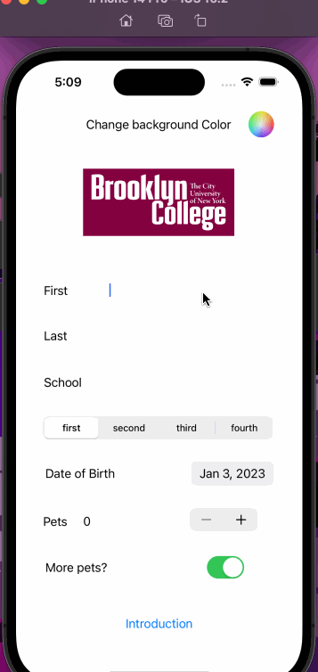

## STUDENT INTRODUCTION 

### App Description 

This app allows students to introduce themsleves by acception use input in various forms such as text fields, switches, segmented controls, and more.

### App Walk-though

  

### Required Features

- [x] 1. App displays an image of a school's logo
- [x] 2. App has three textfields for first, last, and school names
- [x] 3. App has a segmented control that changes student year
- [x] 4. Number of pet matches label is increased/decreased by stepper
- [x] 5. Switch makes a statement about wanting more pets or not(true/false) 
- [x] 6. Introduce yourself button shows alert box with an introduciton and dismiss button

### Optional Features

- [ ] 1. User can tap a button to change the color of the background view
- [x] 2. User can select on additional buttons that provide more info about the user. Example: more textfields, a different alert box, etc.
- [x] 3. Any stylistic changes that are not default options 
        (1. User can change the color of the background view using a color well)
